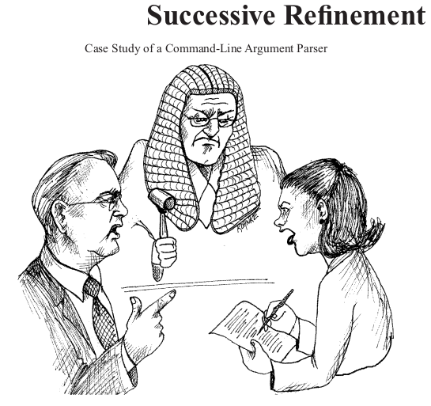

# Clean Code Kitap Özeti

  
   

Merhabalar,yazılım dünyasında bir mihenk taşı olarak kabul görülen, ve sektörde "clean" yazıyor musun gibi literatüre girmiş bir konuyu sizinle paylaşmak istiyorum. İlk olarak kitap ve yazarından kısaca bahsedeyim.

Robert C. Martin(Uncle Bob); 1970'ten beri bir yazılım uzmanı olan Robert, son 40 yılını Agile Alliance'ı başlatmaktan Agile Programming, Clean Code ve daha fazlası hakkında dönüm noktası niteliğindeki kitaplar yazmaya kadar alanın iyileştirilmesine katkıda bulundu. Bu kitap teknik, pragmatik ve önemlidir. Yazar, teoride neyin işe yarayabileceğinin aksine, pratikte neyin işe yaradığını yazmaya kendisini adamış son derece deneyimli usta ve profesyoneldir.

Not çıkarırken önemli gördüğüm yerleri yazdım yani bu bir özet niteliğindedir. En doğru kaynak tabi kide kitabın kendisini okumanızdır. Uzun bir yazıdan çok madde madde ilerleyerek sizlere yalın halde aktarmayı hedefliyorum. Kitap toplamda 17 bölümden oluşuyor ve tüm bölümlerden bahsedeceğim. Haydi başlayalım;

## İçerik tablosu

- [Chapter 01 - Clean Code](#chapter-01-clean-code)
- [Chapter 02 - Meaningful Names](#chapter-02-meaningful-names)
- [Chapter 03 - Functions](#chapter-03-functions)
- [Chapter 04 - Comments](#chapter-04-comments)
- [Chapter 05 - Formatting](#chapter-05-formatting)
- [Chapter 06 - Objects and Data Structures](#chapter-06-objects-and-data-structures)
- [Chapter 07 - Error Handling](#chapter-07-error-handling)
- [Chapter 08 - Boundaries](#chapter-08-boundaries)
- [Chapter 09 - Unit Tests](#chapter-09-unit-tests)
- [Chapter 10 - Classes](#chapter-10-classes)
- [Chapter 11 - Systems](#chapter-11-systems)
- [Chapter 12 - Emergence](#chapter-12-emergence)
- [Chapter 13 - Concurrency](#chapter-13-concurrency)
- [Chapter 14 - Successive Refinement](#chapter-14-successive-refinement)
- [Chapter 15 - JUnit Internals](#chapter-15-junit-internals)
- [Chapter 16 - Refactoring SerialDate](#chapter-16-refactoring-serialdate)
- [Chapter 17 - Smells and Heuristics](#chapter-17-smells-and-heuristics)
- [Referans](#referans)

## Chapter-01 Clean Code

  
   

- Kod yazarken minimal ve düz mantık olmalı. Bu sayede maintenance kolay olur ve error handling konusunda problemler minimal olur.
- Yazılan kod niyetini basit ve etkili bir biçimde yani direkt aktarabilmesi gerekli.
- Okunurluğu yüksek olmalı. Örneğin gazete gibi yukarıdan aşağıya doğru okurken takılmamalı ve rahatça anlaşılabilir olması gerekir.
- Kodu okuyan kişinin beklentisini karşılayabilmesi gerekmektedir.
- Bir kodun clean olduğu okurken ne kadar az yorum yapıldığı ile anlaşılır. Örneğin burada ne demek istemiş sorusunu yada bu ne işe yarıyor gibi şeyleri ne kadar az söylersek o kadar clean olmuştur.
- Tüm testlerden geçmesi gerekmektedir. Testler bir kodun stability artırır ve hataları minimuma yaklaştır.
- Kodun içerisinde tekrar eden kod parçaları olmamalı.
- Minimal class, method, function olması gerek.

## Chapter-02 Meaningful Names

  
   

- Variable isimleri okununca ne olduğu anlaşılır olmalı.
- Sabit değerler static variable olarak tutulmalı.
- Variable isimleri genel geçer isimler ile aynı olamalı. Örneğin, kullanılan dilin sabit isimleri yada Unix platformunun kullanılan isimlendirmelerden kaçınmalıdır.
- Programcı kodun anlamını gizleyen yanlış ipuçları bırakmaktan kaçınmalıdır
- Herhangi bir listeyi belir belirtmek için sonuna "List" eklememeliyiz. Ait olduğu şeyi çoğul kullanmalıyız. Örneğin, animal -> animals.
- Anlamlı ayrımlar yapmamalıyız yani noise words kullanmaktan kaçınmalıyız.("the","a","an",etc.)
- Telaffuz edilebilir isimlendirmeler kullanmalıyız.
- Aranabilir isimlendirmeler koymalıyız. İlgili şeyleri belirli bir pattern ile yazmak gibi.
- Bir variable scope göre verilen isimlendirme anlamı doğru oranda artmalıdır.
- Encoding edilmiş değişken isimleri kullanmaktan kaçınmalıyız.
- Class isimlendirmesi verb olmamalıdır.
- Methods isimlendirmesi verb yada verb phrase olmalıdır.
- İsimlendirmeler de şakacı, komik ve alaycı davranmayın. Yani kelime oyunu yapmayın.
- Her abstract concept için farklı bir kelime seçin ve ona bağlı kalın.
- Kodunuzu okuyan kişilerin programcı olacağını unutmayın. Computer Science terimlerini, algoritma adlarını, kalıp adlarını, matematik terimlerini vb. kullanın.

## Chapter-03 Functions

  
   

- Fonksiyonlar ve metotlar, class'ların behevior'larını yönetirler.
- Bir fonksiyon uzunluğu 100 satırı geçmemeli. Geçmesi durumunda test yazmayı zorlaştırır.
- Satır uzunluğu 150 karakteri geçmemesi gereklidir. Geçmesi durumunda okunurluğu düşürür.
- Fonksiyon tek bir işten sorumlu olmalıdır. Yani tek bir şey yapmalıdır.
  "Functions should do one thing. They should do it well. They should do it only."
- Fonksiyonumuzun tek bir şey yaptığından emin olmak için, fonksiyondaki tüm ifadelerin aynı abstraction düzeyinde olduğundan emin olmamız gerekir.
- Kod yukarıdan aşağıya doğru akmalıdır. (The Stepdown Rule)
- Fonksiyonumuzu bölerken domain bazlı bölme işlemi yapmalıyız.
- Switch case her zaman kaçınamayız, ancak her bir switch case low-level class gömüldüğünden ve asla tekrarlanamadığından emin olabiliriz. Bunu elbette polymorphism ile yapıyoruz.
- Switch case ile fonksiyonları değil, class'ları çağırmalıyız.
- Fonksiyon isimleri çok uzun yada encoding biçiminde olmamalıdır.
- Bir fonksiyon 3-4 argument geçmemelidir. Daha fazlasından kaçınmalıyız. Test edilebilirliği zorlaştırıyor.
- Daha fazla argument yollamak için ya bir object yada list yollamalıyız.
- Ortak monadic form'dan kaçınmalıyız.
- Flag argument eklemekten kaçınmalıyız. Bu işlevin birden fazla şey yaptığını gösterir. Flag doğruysa bir şey yapar, yanlışsa başka bir şey yapar!
- Side effect'e yol açmamalı. Yani gizlice başka şeylere etkisi olamamalı.
- Fonksiyon ya bir şey yapmalı ya da bir şeye cevap vermeli, ikisini birden yapmamalı. Ya senin fonksiyon bir object durumunu değiştirmeli veya hakkında bazı bilgiler döndürmelidir.
- Error handling'te bir şeydir ve ayrı yönetilmelidir.
- DRY principle(Don’t Repeat Yourself) kendini tekrar etmemek olarak karşımıza gelen güçlü bir prensiptir. Tekrar eden işler karmaşıklığı artırır.
- İlk olarak fonksiyonu çalışır şekilde yaz ve sonra refactoring ederek clean'e çek.

## Chapter-04 Comments

  
   

- Rastgele yorum yazılmamalı. Hiç bir amacı olmayan yada rastgele yazılacağına hiç yazılmaması gerekir.
- Kod ile anlatacağın şeyleri yorum ile anlatmak başarısızlıktır.
- Yorumlar kötü kodu telafi etmez. Yorumlar kötü kodlar için yazılmamıştır.
- Anlatmaya çalıştığın şeyi kodla anlat.
- En iyi yorum bir yolunu bulup yazmadığın yorumdur.
- Bazen kurumsal kodlama standartlarımız bizi yasal amaçlar için belirli yorumlar yazmaya zorlar. Yani legal comment yazabiliriz.
- Bilgilendirme yorumları yazabiliriz. (tarih format, regex, etc.)
- Yorumu niyetimizi anlatmaya çalışırken kullanmalıyız.
- Test yazarken yada koda bir işlem sonucunun ne gelmesi gerektiği yoruma yazılabilir.
- İptal edilen yada sorun çıkaran koda yorum yazılabilir.
- TODO yorumlar yazılabilir.
- Önemsiz gözüken bir kısmı öneminin vurgulanması için yazılabilir.
- Kötü yorum kötü kodun bahanesidir.
- Yapmak için yapacaksan hiç yapma. Üstüne düşünerek ve kafa yorarak yorum yazılmalı gerekmektedir.
- Kodu özetleyen yorum yazılmamalı.
- Yorumun ne için yazıldığı belirli olmalı.
- Kodun en tepesinde günlük tarzı yorumlar tutma.
- Boş yorumlar yazma. (Noise Comments)
- Yazdığın kodun aynısını yoruma yazma. (Scary Noise)
- Bazen programcılar bir kaynak dosyada belirli bir konumu işaretlemeyi severler. Bunu yapma.(Position Markers)
- Koda yorum olarak yazar ekleme.
- Kapanan bir parantezin sonuna hangisinin kapandığını yorum olarak yazma.

## Chapter-05 Formatting

  
   

- Formatting önemli bir konudur. Farklı formatlar olduğu zaman yapılan değişiklikler asla tespit edilemez. Koda ki diff her zaman anlaşılmaz olur.
- Vertical formatlama önemlidir. Bir kaynak dosya ne kadar büyük olmalıdır sorusuna genel bir cevap vardır. Çok uzun olmaması önerilir. Bunun bir log ölçeği olduğuna dikkat edin, bu nedenle Vertical konumdaki küçük fark, mutlak boyutta çok büyük bir fark anlamına gelir.
- The Newspaper Metaphor; yani bir source dosyasının gazete makalesi gibi olmalıdır. İsim basit ama açıklayıcı olmalıdır. İsim tek başına doğru modülde olup olmadığımızı bize anlatmaya yeterli olmalıdır. Source dosyanın en üst kısımları üst düzey kavramları ve algoritmaları sağlamalıdır. Aşağıya doğru ilerledikçe detay artmalıdır, sonunda source dosyada en düşük seviyedeki fonksiyonları ve detayları bulana kadar. Bir gazete birçok makaleden oluşur; çoğu çok küçüktür. Bazıları biraz daha büyük. Çok azı bir sayfanın tutabileceği kadar metin içerir. Bu, gazeteyi kullanılabilir hale getirir. Gazete, gerçeklerin, tarihlerin ve isimlerin düzensiz bir yığınını içeren uzun bir hikaye olsaydı, o zaman onu okumazdık.
- Vertical Openness Between Concepts; neredeyse tüm kodlar soldan sağa ve yukarıdan aşağıya okunur. Her satır bir ifadeyi veya bir cümleyi temsil eder ve her satır grubu tam bir düşünceyi temsil eder. Bu düşünceler birbirinden boş satırlarla ayrılmalıdır.
- Vertical Density; Açıklık kavramları birbirinden ayırıyorsa, Vertical Density yakın ilişki anlamına gelir. Bu nedenle, sıkı bir şekilde ilişkili olan kod satırları dikey olarak yoğun görünmelidir.
- Vertical Distance; Yakın ilişkili kavramlar dikey olarak birbirine yakın tutulmalıdır. Ayrı dosyalardaki kavramlar için geçersizdir. Yakından ilişkili kavramlar farklı dosyalara ayrılmamalıdır.
- Variable Declarations; variables mümkün olduğunca kullanıldığı yere yakın tanımlanmalıdır.
- Instance variables; class'ların en üstünde tanımlanmalıdır.
- Dependent Functions; Bir fonksiyon diğerini çağırırsa, bunlar dikey olarak yakın olmalı ve mümkünse arayan, arananın üzerinde olmalıdır.
- Conceptual Affinity; belirli kod parçaları, diğer parçalarla yakınında olmak ister. Belli bir kavramsal yakınlıkları var. Bu yakınlık ne kadar güçlüyse,
  aralarında daha az dikey mesafe olmalıdır. Örnek; assert fonksiyonları, çünkü ortak bir adlandırma şemasını paylaşırlar ve aynı temel görevin varyasyonlarını gerçekleştirirler.
- Vertical Ordering; genel olarak, fonksiyon çağrısı bağımlılıklarının aşağı yönü göstermesini istiyoruz. Yani çağrılan bir fonksiyon, çağıran bir fonksiyonun altında olmalıdır
- Horizontal formatlama önemlidir. Bu, satırlarımızı kısa tutmaya çalışmamız gerektiğini gösteriyor. Satır uzunluğumuz 100-120 karaktere kadar çıkabilir.
- Horizontal Openness and Density; aralarındaki ilişkinin güçlü yada zayıf olmasına göre ayırmak için boşluk kullanırız.
- Horizontal Alignment; variable tanımlarken yatay hizalama yapmak yararsızdır.
- Indentation; kodun yukarıdan aşağıya doğru yapısal bir taslağı vardır. Buna uyulması gerekmektedir.
- Breaking Indentation; kısa tanımları tek satıra düşürme.
- Team Rules; her programcının kendi favori formatting kuralları vardır, ancak bir ekipte çalışıyorsa, o zaman ekip kuralları koyar.

## Chapter-06 Objects and Data Structures

  
   

- Data abstraction ile verilerimizi saklayabiliriz. (Getter, Setter)
- Procedural kod kullanımı mevcut data structures'ı değiştirmeden mevcut fonksiyon eklenmesini sağlar.
- Object-Oriented kod mevcut fonksiyonlarını değiştirmeden yeni class'lar eklemeyi kolaylaştırır.
- Procedural kod tüm fonksiyonları değişmesi gerektiğinden yeni data structures eklemek zordur.
- Object-Oriented kod tüm class'lar değişmesi gerektiğinden yeni method'lar eklemek zordur.
- Hibrit yapılardan uzak durulmalıdır. Her şeyi zorlaştırır.
- Object dönem bir yapıda, onun üzerinden objeye erişilememesi gerekmektedir. Data structures dönen bir yapıdan, onun üstünden yapının method'una erişilememesi gerekmektedir.
- Data structures ve object'lerden hibrit yapılar kurulmamalıdır.
- Data Transfer Objects; bir data structures'ın özlü biçimi, public variables'ı olan ve fonksiyonları olmayan bir class'tır. Buna bazen veri aktarım nesnesi veya DTO denir. DTO'lar, özellikle veritabanıyla iletişim kurarken veya soketler den gelen mesajları ayrıştırırken vb. çok kullanışlı yapılardır.

## Chapter-07 Error Handling

  
   

- Kodu if-else ile kontrol etmektense expection dön.
- Farklı farklı hatalar oluşturabiliriz ve bunları yönetebiliriz.
- Bir Try-Catch-Finally deyiminin Try kısmında kod yürüttüğünüzde, yürütmenin herhangi bir noktada iptal edilebileceğini ve ardından Catch konumunda devam edebileceğini belirtmiş olursunuz. Try blokları bir bakıma transactions gibidir. Catch, denemede ne olursa olsun, programınızı tutarlı bir durumda bırakmalıdır.
- Exception oluşturabilecek bir kod yazarken Try-Catch-Finally ifadesiyle başlamak iyi bir uygulamadır.
- Unchecked Exceptions kullanın.
- Context Exceptions sağlayın.
- Kendi error handling yapını kurmalısın.
- Fonksiyonlar null değer dönmemeli.
- Fonksiyonlara null değer pass edilmemeli.

## Chapter-08 Boundaries

  
   

- Bazen Third-Party paketleri satın alırız veya açık kaynak kullanırız. Bir şekilde bu yabancı kodu kendi kodunuza temiz bir şekilde entegre etmeliyiz. Bu bölümde, yazılımımızın sınırlarını temiz tutmaya yönelik uygulamalara ve tekniklere bakıyoruz.
- Using Third-Party Code; direkt kullanma. Bu kod içerisinde çok fazla bağımlılık ve zafiyet doğuruyor. Onun yerine onu kullanan tek bir client yazıp kendi kodun içerisinde istediğin yerden daha kısıtlı bir şekilde erişim sağlayabilirsin. Anlaşılması daha kolay ve kötüye kullanılması daha zor olan bir kodla sonuçlanır.
- Third-Party bağımlılığın olduğunda mock data ile test edebilirsin.
- Third-Party kodu için testler yazmak bizim çıkarımıza olabilir. Third-Party kitaplığımızı nasıl kullanacağınızın net olmadığını varsayalım. Belgeleri okumak ve onu nasıl kullanacağımıza karar vermek için bir veya iki gün (veya daha fazla) harcayabiliriz. Ardından, Third-Party kodunu kullanmak için kodumuzu yazabilir ve düşündüğümüzü yapıp yapmadığını görebiliriz. Karşılaştığımız hataların bizim kodumuzda mı yoksa onların kodunda mı olduğunu anlamaya çalışırken kendimizi uzun hata ayıklama oturumlarında saplanıp kalmış bulsak şaşırmayacağız.
- Third-Party kodunu öğrenmek ve entegre etmek zordur. İkisini aynı anda yapmak iki kat daha zor. Üretim konumuzdaki yeni şeyleri denemek ve denemek yerine, Third-Party kodu anlayışımızı keşfetmek için bazı testler yazabiliriz. Jim Newkirk bu tür testleri öğrenme testleri olarak adlandırır.
- Öğrenme testleri hiçbir şeye mal olmaz. Her halükarda API'yi öğrenmemiz gerekiyordu ve bu testleri yazmak, bu bilgiyi elde etmenin kolay ve izole bir yoluydu. Öğrenme testleri, anlayışımızı artırmaya yardımcı olan kesin deneyimlerdir.
- Öğrenme testleri ücretsiz olmasının yanı sıra olumlu bir yatırım getirisine sahiptir. Third-Party paketinin yeni sürümleri olduğunda, davranışsal farklılıklar olup olmadığını görmek için öğrenme testleri çalıştırıyoruz.
- Bazen geliştirilmekte olan başka bir modüle bağlanacak bir modülde çalışmak gerekir ve API henüz tasarlanmadığı için bilgilerin nasıl gönderileceği hakkında hiçbir fikrimiz yoktur. Bu durumlarda, bekleyen modül ile iletişimi encapsulation için bir interface oluşturmanız önerilir. Bu şekilde modülün kontrolünü elimizde tutuyoruz ve ikinci modül henüz mevcut olmasa da test edebiliyoruz.
- Sınırlarda ilginç şeyler oluyor. Değişim de bunlardan biridir. İyi yazılım tasarımları, büyük yatırımlar ve yeniden çalışma gerektirmeden değişime ayak uydurur. Kontrolümüz dışında bir kod kullandığımızda, yatırımımızı korumak ve gelecekteki değişikliklerin çok maliyetli olmamasını sağlamak için özel dikkat gösterilmelidir.

## Chapter-09 Unit Tests

  
   

- Test-Driven Development'ın 3 kuralı, bu üç kural sizi döngüye hapseder ve istenilen geliştirme yapılana kadar tekrarlanır;
  - Başarısız bir unit testi yazmadan production kodu yazamazsınız.
  - Başarısız olmak için yeterli olandan daha fazla unit testi yazamayabilirsin ve compiling başarısız olur.
  - Halihazırda başarısız olan testi geçmek için yeterli olandan daha fazla production kodu yazamazsınız.
- Testleri clean tut.
- Test kodu, production kod kadar önemlidir.
- Code Base de değişiklik yapmamızı kolaylaştırır.
- Testler kesinlikle onurluğu yüksek olamalı ve okunabilir olmalı.
- Test başına bir assert'ta sahip olmalı.
- Her test tek bir işi test etmeli.
- Clean testler bu kısaltmayı takip eder. F.I.R.S.T
  - Fast -> Testler hızlı olmalı.
  - Independent -> Testler bağımsız olmalı.
  - Repeatable -> Testler her ortamda test edilebilir olamalıdır.
  - Self-Validating -> Testler bir sonuç içermeli.(Fail or Pass)
  - Timely -> Testler zamanında yazılması,test yazımını daha başarılı kılar.

## Chapter-10 Classes

  
   

- Class organizasyonu (java convention'a göre)
  1. Variables listesi.
  2. Public static constants variables.
  3. Private static variables.
  4. Private instance variables.
  5. Public variable.
  6. Public functions.
  7. Private utilities.
- Yukarıdaki adımları takip eder ve programın bir gazete makalesi gibi okunmasına yardımcı olur.
- Encapsulation; class içerisindeki variables'a direkt erişmek yerine, fonksiyonlar üzerinden erişim sağlanmasıdır.
- Class'lar küçük olamalıdır. Ölcebilmek için sorumluluğuna bakılmalıdır.
- Bir Class yada fonksiyon birine anlatırken, tanımlarken "eğer(if)", "ve(and)", "yada(or)" ve "ama(but)" kelimelerini kullanıyorsan birden fazla sorumluluğa sahip demektir. Clean değildir.
- The Single Responsibility Principle (SRP); bir class veya module yalnızca bir sorumluluğu,değişmesi için yalnızca bir nedeni olması gerektiğini belirtir.
- Bir şeyi yaptım bitti mantığı yanlıştır. Dönüp iyleştirme odaklı olmalısın.
- Hedef işi yapan birden çok ve kendi arasında rotate eden yapılara sahip olmalısın.
- Cohesion; birbirine yakın olan yapıları bir arada tutmalısın.
- Clean code yazmak değişim zamanındaki riski büyük oranda azaltır eder.
- Bazı geliştirmelerde yani class yazmak, sistemin SRP özelliğini korur. Bu yapılması gereken işlemdir. Bu sayede yeni eklenecek yapılar mevcut yapıyı değiştirmeden eklememizi sağlar.
- Isolation için abstract class'lar, interface'lere bağımlı olun.

## Chapter-11 Systems

  
   

- Complexity ölcülmelidir.
- Yapım aşaması ile kullanım aşaması birbirinden farklıdır ve ayrılmalıdır.
- Builder patterns kullanılabilinir.
- Dependency Injection; ikincil sorumlukları bir nesneden(IOC) amaca tahsis edilmiş diğer nesnelere tahsis eder ve böylece SRP desteklenir.
- Dependency injection, bağımlılıkları enjecte eden method ve constructor argümant sağlar ve bağımlılıkları birbirine bağlar.
- System Design önemli bir unsurdur.
- Separate concerns adequate yapısı düzgün kurgulanmalıdır.
- Cross-Cutting concerns çözmek için aspect-oriented programming (AOP) kullanılmalıdır.
- Basit ve genişlemeye açık olan sistemler üzerinde dur.
- Sistem test edilebilinir tasarlanmalıdır.
- Standartlar değer kattığını görebiliyorsan, kullanmalısın.
- System clean olamalıdır. Sürecler Agile ilerlenmeli ve TDD odaklı yaklısım sergilenmelidir.
- Hangi seviyede olursanız olun basit düşünmelisiniz.

## Chapter-12 Emergence

  
   

- Kent Beck'in dört kuralının iyi tasarlanmış bir yazılım yaratmada önemli ölçüde yardımcı olduğunu düşünüyoruz. Kent'e göre bir tasarım, şu kurallara uyuyorsa basittir;
  - Tüm testleri çalıştırır.
  - Tekrarlanan kod içermez.
  - Programcının amacını net ifade edmişse.
  - Class ve method sayısını en aza indirir.
- Refactoring önemlidir. Düzenli yapılmalı ve sorgulanmalıdır.
- Design pattern kullanımında isimlendirme pattern'ına dikkat edilmelidir. Bu okunurluğu artırır.
- Çok fazla pratik yapmak gereklidir.

## Chapter-13 Concurrency

  
   

- Objeler process'lerin absraction'larıdır. Thread'ler ise schedule'un.
- Concurrent programlama kolay değildir. Özellikle yük altında çalışmaya başladığı zaman problemler ortaya çıkacaktır.
- Concurency bir ayrıştırma stratejisidir.(Decoupling)
- Ne zaman çalışacağına schedule belirler.
- Aynı anda birden fazla şey ile muhatap olunuyor.
- Concurency her zaman performansı artırmaya bilir.
- Concurency bir sistem yapılacaksa tasarım değişmelidir.
- Concurency update ve deadlock ile nasıl başa çıkacağını bilmen gereklidir.
- Aynı hatayı yeniden simile etmek zordur.
- Concurency'nin bir life cycle'ı vardır. Ama diğer kod kısımlarından tamamen farklı ve ayrı tutulmalıdır.
- Data consistency için "Lock" kullanılır. Atomic yapılarda aynı işlemi arka kısımda gerçekleştirmektedir.
- Data encopsulation'ı önde tut ve paylaşımlı data ile oynamayı azalt.
- Thread'ler bağımsız olmalıdır. Örnekler, ReentrantLock, Semaphore CountDownLatch.(Öneri: Kullanabileceğiniz sınıfları gözden geçirin.)
- Execution Models; Bound Resources, Mutual Exclusion, Starvation, Deadlock, Livelock. Örnekler; Producer-Consumer,Readers-Writers, Dining Philosophers. (Öneri: Bu temel algoritmaları öğrenin ve çözümlerini anlayın)
- Synchronized Methods; Client-Based Locking,Server-Based Locking,Adapted Server. (Öneri: Paylaşılan bir nesne üzerinde birden fazla yöntem kullanmaktan kaçının)
- Synchronized bölümlerinizi mümkün olduğunca küçük tutun.
- Doğru Shut-Down Kodunu Yazmak Zordur. Graceful shutdown düzeltilmesi zor olabilir. (Öneri: Kapatmayı erken düşünün ve erkenden çalışmasını sağlayın. Beklediğinden daha uzun sürecek. Mevcut algoritmaları gözden geçirin çünkü bu muhtemelen düşündüğünüzden daha zordur.)
- Test etmek için değişik senaryolarda denemeler yapın.
  - Threading hataları ele al.
  - Nonthreaded kodları önce çalıştır.
  - Thread kodu pluggable yap.
  - Thread kodu ayarlanabilir yap.
  - İşlemci sayısından daha fazla thread çağır.
  - Farklı platformlarda çalıştır.
  - Hataları denemek ve sistemi zorlamak için kod kullan.

## Chapter-14 Successive Refinement

  
   

- Bu chapter bir CLI uygulamasının argument parser yapısını inceleyen case study'dir.
- Kod üzerinden anlatım yapılmaktadır. Bu chapter direkt okunmalıdır.
- Çalışan kod sadece bir işe yaramaz. İleride bozulur ve çalışmaz.
- Bir projede kötü kodun etkisi çok fazladır.
- Kötü kod çok fazla technical debt yaratır.
- Kodu clean'e çekmenin zaman maliyeti çok fazladır.
- Kötü kod birden fazla dependency yaratır ve bunu çözümlemek süreçleri daha zorlaştırır.

## Chapter-15 JUnit Internals

  
   

- Bu chapter JUnit framework'ün bir kısmını eleştiriyor.
- Kod üzerinden anlatım yapılmaktadır. Bu chapter direkt okunmalıdır.
- Framework'ler söz konusu olduğunda, JUnit tasarım açısından basit, tanım açısından kesin ve uygulama açısından zekicedir.
- Testlerin coverage'ı önemlidir.
- Her birimizin kodu bulduğumuzdan biraz daha iyi bırakma sorumluluğu vardır.

## Chapter-16 Refactoring SerialDate

  
   

- Bu chapter'da JCommon library'sinin org.jfree.date paketinin SerialDate class'ı var ve onu refactor ediyor.
- Kod üzerinden anlatım yapılmaktadır. Bu chapter direkt okunmalıdır.
- Eleştiri iyidir ve insanı geliştirir.
- İlk olarak kodun çalışmasını sağla. Her şeyi test ettiğinden emin ol ve testlerden geçmesini sağla.
- Kodu bulduğundan daha clean bırak. Bu zaman alabilir ama buna değer.

## Chapter-17 Smells and Heuristics

  
   

- Bu chapter Martin Fowler'un Refactoring kitabındaki “Code Smells" tanımından bahsediyor.
- Comments
  - C1: Inappropriate Information; kodun haricindeki her şeyi farklı bir yerde tut. Yorumlar, kod ve tasarımla ilgili teknik notlar için ayrılmalıdır.
  - C2: Obsolete Comment; yorumlar hızlı yaşlanırlar. Yorumu silebildiğin noktada silmelisin.
  - C3: Redundant Comment; gereksiz yere yorum yazma.
  - C4: Poorly Written Comment; eksik yada zayıf yazılmış yorumlar olmamalıdır.
  - C5: Commented-Out Code; bir kod yorumlanıyorsa bu bir iğrençliktir.
- Environment
  - E1: Build Requires More Than One Step; bir projeyi çalıştırmak basit olmalıdır.
  - E2: Tests Require More Than One Step; testleri çalıştırmak kolay olmalıdır.
- Functions
  - F1: Too Many Arguments; fonksiyonların az sayıda argümanı olmalıdır. 3-4'ten fazla argümanı var ise kendini sorgula.
  - F2: Output Arguments; fonksiyonun bir nesnenin durumunu değiştirmesi gerekiyorsa, onu çıktı olarak geçmektense çağrıldığı nesnenin durumunu değiştirmesini sağlayın.
  - F3: Flag Arguments; boolean parametre olması fazla işlem yaptığını ifade eder.
  - F4: Dead Function; ölü fonksiyonları sil.
- General
  - G1: Multiple Languages in One Source File; bir dosyanın içerisinde birden fazla dil kullanmaktan kaçın.
  - G2: Obvious Behavior Is Unimplemented; okuduğumuz kod beklentimizi karşılamalı. Bir çıktı beklerken farklı bir şey sunmamalı.
  - G3: Incorrect Behavior at the Boundaries; yazdığın koda güvenme, her boundary condition için test yazmaya çalış.
  - G4: Overridden Safeties; güvenlik adımlarını atlama.
  - G5: Duplication; en önemli kurallardan birisidir. Dave Thomas ve Andy Hunt buna DRY principle (Don’t Repeat Yourself) adını verdi. Kent Beck, bunu Extreme Programming'in temel ilkelerinden biri haline getirdi ve “Once, and only once.” dedi. Ron Jeffries, bu kuralı tüm testlerin geçmesini sağlamanın hemen altında ikinci sırada tutuyor. Kodda duplication gördüğünüz her zaman, abstraction için kaçırılmış bir fırsatı temsil eder. Switch/case yada if/else yapılarını polymorphism ile değiştirin. Benzer algoritmalara sahip olan ancak benzer kod satırlarını paylaşmayan modüller daha da inceliklidir. Bu yine bir tekrardır ve "TEMPLATE METHOD" veya "STRATEGY PATTERN" kullanılarak ele alınmalıdır.
  - G6: Code at Wrong Level of Abstraction; yanlış seviyede abstraction yapılmamalı.
  - G7: Base Classes Depending on Their Derivatives; base class'ın sub class'tan gelen şeylere depend olmaması gereklidir.
  - G8: Too Much Information; iyi tanımlanmış modüller, çok az şeyle çok şey yapmanıza izin veren çok küçük interface'lere sahiptir. Bu şekilde interface'ler tanımlanmalıdır.
  - G9: Dead Code; ölü yani kullanılmayan kodlar tespit edilmeli ve silinmelidir.
  - G10: Vertical Separation; değişkenler ve fonksiyon kullanıldıkları yere yakın tanımlanmalıdır.
  - G11: Inconsistency; isimler tüm projede yaptıkları işe göre tutarlı bir şekilde isimlendirilmelidir.
  - G12: Clutter; kullanmadığın şeyleri silmelisin.
  - G13: Artificial Coupling; birbirine bağlı olmayan şeyler yapay olarak birleştirilmemelidir.
  - G14: Feature Envy; bir class'ın metotları, diğer class'ın değişkenleri ve fonksiyonları ile değil, ait oldukları class'ın değişkenleri ve fonksiyonları ile ilgilenmelidir.
  - G15: Selector Arguments; davranışı seçmek için bir fonksiyona bazı kodlar geçirmektense birçok fonksiyona sahip olmak daha iyidir.
  - G16: Obscured Intent; kod anlamlı ve okunabilir olmalı.
  - G17: Misplaced Responsibility; kullandığınız kodu doğru bir yere koyduğunuzdan emin olun. İlişkili yapıları bir arada tutmalısınız.
  - G18: Inappropriate Static; statik olmayan metotları statik metotlara tercih etmelisiniz. Bir fonksiyonun gerçekten statik olmasını istiyorsanız, polymorphically davranmasını isteme şansınızın olmadığından emin olun.
  - G19: Use Explanatory Variables; değişken isimleri iyi ve açıklayıcı olmalıdır.
  - G20: Function Names Should Say What They Do; bir fonksiyon ismi kendi yaptığı işi açıklamalıdır.
  - G21: Understand the Algorithm; algoritmayı anlamanın en iyi yolu, fonksiyonun, nasıl çalıştığını açıkça gösterecek kadar temiz ve anlamlı bir şey olana kadar refactor etmektir.
  - G22: Make Logical Dependencies Physical; bir modül diğerine depend ise, bu dependency sadece mantıksal değil, fiziksel de olmalıdır.
  - G23: Prefer Polymorphism to If/Else or Switch/Case; kod yazarken switch/case yada if/else yapısı yerine, polymorphism ile değiştirin.
  - G24: Follow Standard Conventions; takım içi kuralların ve standartların belirlenmesi gerekmektedir.
  - G25: Replace Magic Numbers with Named Constants; kodunuzda ham sayılar olması kötü bir fikirdir. Onları iyi adlandırılmış constant'ların arkasına saklamalısınız.
  - G26: Be Precise; koddaki belirsizlikler ve tutarsızlıklar sebebi ya anlaşmazlıkların ya da tembelliğin sonucudur. Her iki durumda da ortadan kaldırılmaları gerekir. Bu sebeple kararlı olmalısın.
  - G27: Structure over Convention; yapısal kuralları her şeyin üstünde tutmalıyız.
  - G28: Encapsulate Conditionals; if condition içerisinde birden fazla yapı kontrol ediliyorsa, bir metotda extract edilmeli ve if içerisinde method çağrılmalıdır.
  - G29: Avoid Negative Conditionals; if condition içerisinde pozitif durumlar kontrol edilmeli.
  - G30: Functions Should Do One Thing; fonksiyon tek bir işten sorumlu olmalı ve yapmalıdır.
  - G31: Hidden Temporal Couplings; zamansal eşleşmeyi açık hale getiren bağımsız değişkenler kullanın.
  - G32: Don’t Be Arbitrary; kod yapınız doğru ve tutarlı olmalıdır.
  - G33: Encapsulate Boundary Conditions; bazı kontrollerde +1 yada -1'e ihtiyaç doğabilir. Kodun her yerine sızmalarına izin vermeyin. +1'lerin ve -1'lerin sağa sola dağılmasını istemiyoruz.
  - G34: Functions Should Descend Only One Level of Abstraction; fonksiyon içindeki ifadelerin tümü, fonksiyon adıyla açıklanan işlemin bir düzey altında olması gereken aynı abstraction düzeyinde yazılmalıdır.
  - G35: Keep Configurable Data at High Levels; yüksek seviyeli sabitlerin değiştirilmesi kolaydır.
  - G36: Avoid Transitive Navigation; A ile B; B ile C işbirliği yaparsa, A modüllerinin C hakkında bilgi sahibi olmasını istemeyiz. Yani A; B üzerinden C'yi bilmemelidir.
- Java
  - J1: Avoid Long Import Lists by Using Wildcards; bir paketten iki veya daha fazla class kullanıyorsanız, paketin tamamını import edin.
  - J2: Don’t Inherit Constants; constants, inheritance hiyerarşisinin en üstünde gizlidir. Inheritance'sı, dilin scope belirleme kurallarını aldatmanın bir yolu olarak kullanmayın.
  - J3: Constants versus Enums; public static final int tanımlamak yerine enum'a başvurun.
- Names
  - N1: Choose Descriptive Names; açıklayıcı ve anlamlı isimler seçin.
  - N2: Choose Names at the Appropriate Level of Abstraction; abstraction seviyesine göre doğru isimlendirmeler seçin.
  - N3: Use Standard Nomenclature Where Possible; tüm isimlendirmelerde yaptığı işi ifade eden isimler kullanın.
  - N4: Unambiguous Names; uzun isimlendirmelerden çekinmeyin, önemli olan açıklayıcı olmasıdır.
  - N5: Use Long Names for Long Scopes; kapsamına göre isimlendirme seçilmelidir.
  - N6: Avoid Encodings; şifrelenmiş isimlendirmeler kullanmayın.
  - N7: Names Should Describe Side-Effects; isimlendirme bir fonksiyonun, değişkenin veya class'ın olduğu veya yaptığı her şeyi tanımlamalıdır. Side-Effects'i bir isimlendirme ile saklamayın, isimlendirmede belirtin.
- Tests
  - T1: Insufficien; test kodu, kodda bozulabilecek her şeyi test etmelidir. Doğrulanmamış testler veya hesaplamalar tarafından keşfedilmemiş koşullar olduğu sürece testler yetersizdir.
  - T2: Use a Coverage Tool; testlerin kodda nereleri cover ettiğini görmek için araçlar kullanın.
  - T3: Don’t Skip Trivial Tests; case'ler önemsiz dahi olsa testleri yazmaktan kaçınmayın.
  - T4: An Ignored Test is a Question about an Ambiguity; testinizi göz ardı ediyorsanız, kodunuzu sorgulayın.
  - T5: Test Boundary Conditions; boundary conditions test etmek için özelikle dikkat edin. Genellikle bir algoritmanın ortasını doğru anlarız, ancak sınırları yanlış değerlendiririz.
  - T6: Exhaustively Test Near Bugs; bir fonksiyonda bir bug bulduğunuzda, o fonksiyonun kapsamlı bir testini yapmak akıllıca olacaktır.
  - T7: Patterns of Failure Are Revealing; iyi düzenlenmemiş test senaryoları, başarısızlık kalıplarını ortaya çıkaracaktır.
  - T8: Test Coverage Patterns Can Be Revealing; pass olan testler tarafından yürütülen veya yürütülmeyen koda bakmak, fail olan testlerin neden fail olduğuna dair ipuçları verir.
  - T9: Tests Should Be Fast; yavaş test, çalıştırılmayacak bir testtir. Testlerinizi hızlı tutmak için yapmanız gerekeni yapın.

## Referans

- <https://www.amazon.com/Clean-Code-Handbook-Software-Craftsmanship/dp/0132350882>
