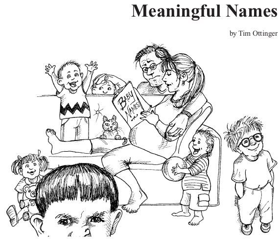
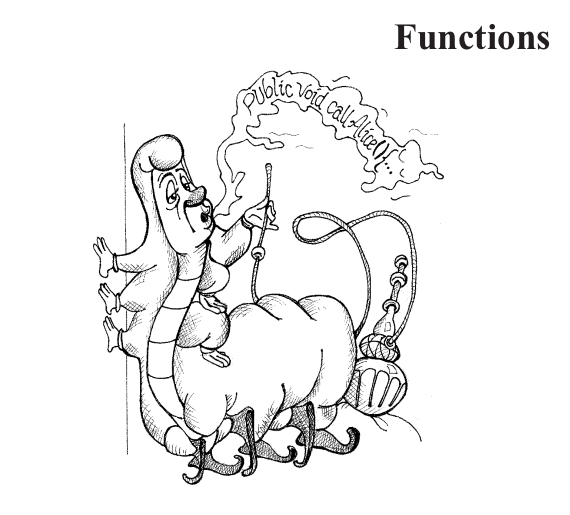
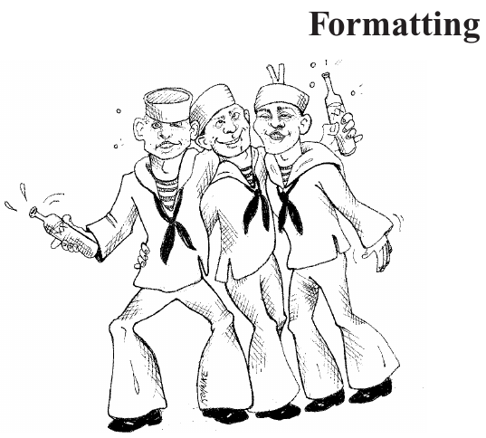
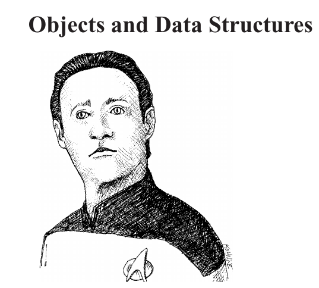
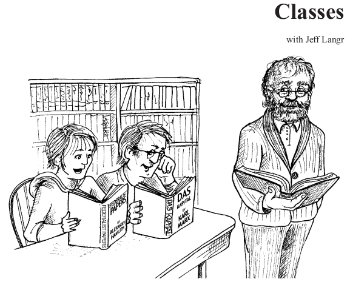
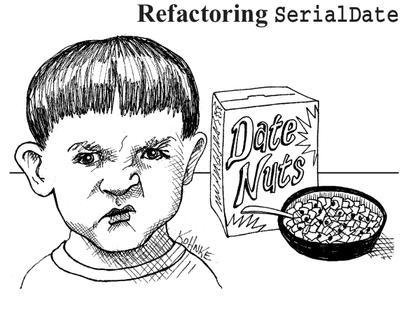
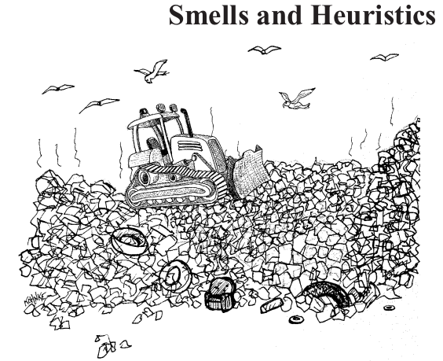

[English](README.md) ∙ [Turkish](README-tr.md)

**Help [translate](TRANSLATIONS.md) this guide!**

# Clean Code Book Summary

  
   

Hello, I would like to share with you an issue that is accepted as a touchstone in the software world and that has entered the literature, such as "Do you write clean" in the industry. First, let me tell you briefly about the book and its author.

Robert C. Martin (Uncle Bob); A software expert since 1970, Robert has spent the last 40 years improving the field, from launching the Agile Alliance to writing landmark books on Agile Programming, Clean Code, and more. This book is technical, pragmatic, and important. The author is a highly experienced craftsman and professionally dedicated to writing what works in practice as opposed to what might work in theory.

While taking notes, I wrote down the points that I consider important, so this is a summary. The best source is, of course, to read the book itself. I aim to convey it to you in a simple way by progressing from a long article, rather than a long article. The book consists of 17 chapters in total, and I will talk about all chapters. So let's start;

## Table of contents

* [Chapter 01 - Clean Code](#chapter-01-clean-code)
* [Chapter 02 - Meaningful Names](#chapter-02-meaningful-names)
* [Chapter 03 - Functions](#chapter-03-functions)
* [Chapter 04 - Comments](#chapter-04-comments)
* [Chapter 05 - Formatting](#chapter-05-formatting)
* [Chapter 06 - Objects and Data Structures](#chapter-06-objects-and-data-structures)
* [Chapter 07 - Error Handling](#chapter-07-error-handling)
* [Chapter 08 - Boundaries](#chapter-08-boundaries)
* [Chapter 09 - Unit Tests](#chapter-09-unit-tests)
* [Chapter 10 - Classes](#chapter-10-classes)
* [Chapter 11 - Systems](#chapter-11-systems)
* [Chapter 12 - Emergence](#chapter-12-emergence)
* [Chapter 13 - Concurrency](#chapter-13-concurrency)
* [Chapter 14 - Successive Refinement](#chapter-14-successive-refinement)
* [Chapter 15 - JUnit Internals](#chapter-15-junit-internals)
* [Chapter 16 - Refactoring SerialDate](#chapter-16-refactoring-serialdate)
* [Chapter 17 - Smells and Heuristics](#chapter-17-smells-and-heuristics)
* [Reference](#reference)

## Chapter-01 Clean Code

  
   

* When writing code, there should be minimal and straight logic. In this way, maintenance is easy and problems in error handling are minimal.
* The written code must be able to convey its intention simply and effectively, that is, directly.
* Must be highly legible. For example, it should not get stuck when reading from top to bottom, such as a newspaper, and it should be easily understandable.
* The person reading the code must be able to meet their expectations.
* When a code is clean, it is understood by how few comments are made while reading it.For example, the less we say the question of what he meant here, or what it does, the cleaner it will be.
* Must pass all tests. Tests increase the stability of a code and minimize errors.
* There should be no repetitive pieces of code in the code.
* It should be a minimal class, method, or function.

## Chapter-02 Meaningful Names

  
   

* Variable names should be clear when read.
* Constant values should be kept as static variables.
* Variable names must be the same as common names. For example, constant names of the language used, or the nomenclature used by the Unix platform should be avoided.
* The programmer should avoid leaving false clues that obscure the meaning of the code
* We should not add "List" to the end of any list to specify it. We should use the plural, what it belongs to. For example, animal → animals.
* We should not make meaningful distinctions, so we should avoid using noisy words("the", "a", "an", etc.)
* We must use pronounceable nomenclature.
* We should put searchable nomenclature. It's like writing-related things with a specific pattern.
* The naming meaning given to a variable scope should increase at the right rate.
* We should avoid using encoded variable names.
* Class naming should not be a verb.
* Methods naming must be verb or verb phrase.
* Do not be playful, funny, and sarcastic in naming. So don't play word games.
* Choose a different word for each abstract concept and stick to it.
* Remember that people who read your code will be programmers. You can use Computer Science terms, algorithm names, pattern names, math terms, etc. use it.

## Chapter-03 Functions

  
   

* Functions and methods manage behaviors of classes.
* A function length must not exceed 100 lines. If it passes, it makes it harder to write tests.
* Line length must not exceed 150 characters. If it passes, it reduces readability.
* The function must be responsible for a single job. So it should only do one thing.
"Functions should do one thing. They should do it well. They should do it only."
* To make sure our function does only one thing, we need to make sure that all expressions in the function are at the same abstraction level.
* The code should flow from top to bottom. (The Step-down Rule)
* When dividing our function, we should do domain-based division.
* We can't always avoid switch cases, but we can make sure that each switch case low-level class is embedded and can never be repeated. We do this, of course, with polymorphism.
* With the Switch case, we should call classes, not functions.
* Function names should not be too long or in encoding format.
* A function should not exceed 3–4 arguments. We should avoid more. It complicates testability.
* To send more arguments, we must either send an object or a list.
* We should avoid the common monodic form.
* We should avoid adding flag arguments. Indicates that this function does more than one thing. The flag does one thing if it's true, and another if it's false!
* It should not cause side effects. So it shouldn't be secretly affecting other things.
* The function should either do something or respond to something, not both. Either your function should change the state of an object or return some information about it.
* It is a thing in error handling and must be managed separately.
* The DRY principle (Don't Repeat Yourself) is a powerful principle that comes across as not repeating yourself. Repetitive tasks increase complexity.
* First write the function as it works and then refactor it to clean.

## Chapter-04 Comments

  
   

* Random comments should not be written. It should not be written at all, instead of having no purpose or being written randomly.
* It is a failure to explain the things that you can tell with the code with comments.
* Comments don't make up for bad code. Comments are not written for bad code.
* Describe what you are trying to tell with code.
* The best comment is the one you didn't find a way to write.
* Sometimes our corporate coding standards force us to write certain comments for legal purposes. So we can write a legal comment.
* We can write informative comments. (date format, regex, etc.)
* We should use the interpretation when trying to express our intention.
* When writing a test or what the result of an operation should come to, the code can be written in the comments.
* Comments can be made on the code that has been canceled or caused problems.
* TODO comments can be written.
* A part that seems insignificant can be written to emphasize its importance.
* Bad comment is an excuse for bad code.
* If you're going to do it for the sake of doing it, don't do it at all. It is necessary to write a comment with thought and thought.
* Comments summarizing the code should not be written.
* The comment should be specific for what it is written for.
* Keep diary-style comments at the top of the code.
* Do not write empty comments. (Noise Comments)
* Do not write the same code you wrote in the comments. (Scary Noise)
* Sometimes programmers like to mark a specific location in a source file. Don't do this. (Position Markers)
* Adding an author as a comment to the code.
* Do not write which one is closed at the end of a closing parenthesis as a comment.

## Chapter-05 Formatting

  
   

* Formatting is an important issue. Changes are never made when different formats are detected. The diff in code is always incomprehensible.
* Vertical formatting is important. There is a general answer to the question of how big a source file should be. It is recommended not to be too long. Note that this is a log scale, so a small difference in Vertical position means a huge difference in absolute size.
* The Newspaper Metaphor; it should be like a newspaper article or a source file. The name should be simple but descriptive. The name alone should be enough to tell us if we are in the right module. The top part of the source file should provide high-level concepts and algorithms. The detail should increase as you go down until you finally find the lowest-level functions and details in the source file. A newspaper consists of many articles; most are very small. Some are a little bigger. Few contain as much text as one page can hold. This makes the newspaper usable. If the newspaper were a long story with an untidy pile of facts, dates, and names, then we wouldn't be reading it.
* Vertical Openness Between Concepts; almost all code is read from left to right and top to bottom. Each line represents a statement or a sentence, and each set of lines represents a complete thought. These thoughts should be separated from each other by blank lines.
* Vertical Density; If openness separates the concepts, Vertical Density means a close relationship. Therefore, tightly related lines of code should appear vertically dense.
* Vertical Distance; Closely related concepts should be kept vertically close together. Invalid for concepts in separate files. Closely related concepts should not be separated into separate files.
* Variable Declarations; variables should be defined as close to where they are used as possible.
* Instance variables; must be defined at the top of the classes.
* Dependent Functions; If one function calls another, they should be vertically closed and the collar above the caller if possible.
* Conceptual Affinity; certain pieces of code want to be close to other pieces. They have a certain conceptual affinity. The stronger this closeness is,
there should be the less vertical distance between them. For example; assert functions because they share a common naming scheme and perform variations of the same basic task.
* Vertical Ordering; In general, we want function call dependencies to point downward. So a called function must be below a calling function
* Horizontal formatting is important. This shows that we should try to keep our lines short. Our line length can be up to 100–120 characters.
* Horizontal Openness and Density; We use spaces to separate them according to whether the relationship between them is strong or weak.
* Horizontal Alignment; Horizontal alignment is useless when defining a variable.
* Indentation; the code has a structured outline from top to bottom. This must be complied with.
* Breaking Indentation; Don't reduce short definitions to one line.
* Team Rules; every programmer has his own favorite formatting rules, but if he works in a team, then the team makes the rules.

## Chapter-06 Objects and Data Structures

  
   

* We can store our data with data abstraction. (Getter, Setter)
* The use of procedural code allows adding existing functions without changing existing data structures.
* Object-Oriented code makes it easy to add new classes without changing existing functions.
* Adding new data structures is difficult as all functions of the procedural code have to change.
* Object-Oriented code is difficult to add new methods because all classes have to change.
* Hybrid structures should be avoided. It complicates everything.
* In an Object-term structure, the object cannot be accessed through it. Data structures cannot be accessed from a rotating structure, from above it.
* Hybrid structures should not be built from data structures and objects.
* Data Transfer Objects; The concise form of a data structure is a class with public variables and no functions. This is sometimes called a data transfer object or DTO. DTOs are especially useful when communicating with the database or parsing messages from sockets etc. They are very useful structures.

## Chapter-07 Error Handling

  
   

* Return expectation rather than checking the code with if-else.
* We can create different errors and manage them.
* When you execute code in the Try portion of a Try-Catch-Finally statement, you indicate that execution can be canceled at any point and then resumed in a catch. Try blocks are like transactions in a way. The catch should leave your program in a consistent state no matter what you try.
* It's good practice to start with the Try-Catch-Finally statement when writing code that can throw an Exception.
* Use Unchecked Exceptions.
* Provide Context Exceptions.
* You should set up your error handling structure.
* Functions should not return null.
* Null values should not be passed to functions.

## Chapter-08 Boundaries

  
   

* Sometimes we buy Third-Party packages or use open source. We have to somehow integrate this foreign code cleanly into our code. In this section, we look at practices and techniques for keeping the boundaries of our software clean.

* Using Third-Party Code; direct use. This code creates many dependencies and vulnerabilities. Instead, you can write a single client that uses it and access it in a more restricted way from anywhere in your code. It results in code that is easier to understand and harder to abuse.
* When you have a Third-Party dependency, you can test it with mock data.

* It may be in our interest to write tests for Third-Party code. Assuming it's not clear how to use our Third-Party library. We might spend a day or two (or more) reading the documentation and deciding how to use it. Then we can write our code to use Third-Party code and see if it does what we think. We wouldn't be surprised if we find ourselves stuck in long debugging sessions trying to figure out whether the bugs we encounter are in our code or theirs.
* Difficult to learn and integrate Third-Party code. Doing both at the same time is twice as difficult. Instead of trying and experimenting with new things in our production location, we can write some tests to explore our understanding of Third-Party code. Jim Newkirk calls these types of tests learning tests.
* Learning tests cost nothing. We had to learn the API anyway, and writing these tests was an easy and isolated way to get that knowledge. Learning tests are definitive experiences that help increase our understanding.
* The learning tests are free and have a positive return on investment. When there are new versions of the Third-Party package, we run learning tests to see if there are any behavioral differences.
* Sometimes it is necessary to work in a module that will connect to another module under development, and we have no idea how to send the information as the API has not been designed yet. In these cases, it is recommended to create an interface to encapsulate communication with the waiting module. This way we have control of the module and can test it even though the second module is not yet available.
* Interesting things are happening at the borders. Change is one of them. Good software designs adapt to change without major investments and rework. When we use code beyond our control, special care must be taken to protect our investment and ensure that future changes are not too costly.

## Chapter-09 Unit Tests

  
   

* 3 rules of Test-Driven Development, these three rules keep you in the loop and iterate until the desired development is done;
  * You cannot write production code without writing a failed unit test.
  * You may not be able to write more unit tests than are enough to fail, and the compiling will fail.
  * You cannot write more production code than is sufficient to pass the already failing test.
* Keep tests clean.
* Test code is just as important as production code.
* Code Base also makes it easier for us to make changes.
* Tests must be strictly dignified and readable.
* Must have one assert per test.
* Each test must test a single job.
* Clean tests follow this abbreviation. F.I.R.S.T.
  * Fast → Tests should be fast.
  * Independent → Tests must be independent.
  * Repeatable → Tests must be testable in any environment.
  * Self-Validating → Tests must contain a result.(Fail or Pass)
  * Timely → Writing tests on time makes test writing more successful.

## Chapter-10 Classes

  
   

* Class organization (according to java convention)
     1. Variables list.
     2. Public static constants variables.
     3. Private static variables.
     4. Private instance variables.
     5. Public variable.
     6. Public functions.
     7. Private utilities.
* Follows the above steps and helps the program read like a newspaper article.
* Encapsulation; Instead of accessing the variables in the class directly, it is to be accessed through functions.
* Classes must be small. To be able to measure, responsibility must be taken into account.
* If you use the words "if", "and", "or" and "but" when describing a class or function to someone, it means you have more than one responsibility. It is not clean.
* The Single Responsibility Principle (SRP); A class or module specifies only one responsibility, and it should have only one reason to change.
* The logic of doing something is done is wrong. You have to be focused on turning around and improving.
* You should have multiple structures that do the target work and rotate between themselves.
* Cohesion; You have to keep the structures that are close to each other together.
* Writing clean code greatly reduces the risk at the time of change.
* In some developments, that is, writing a class preserves the SRP feature of the system. This is what needs to be done. In this way, it allows us to add new structures to be added without changing the existing structure.
* Abstract classes for isolation, depend on interfaces.

## Chapter-11 Systems

  
   

* Complexity should be measured.
* The construction phase and the usage phase are different from each other and should be separated.
* Builder patterns can be used.
* Dependency Injection; It allocates secondary responsibilities from one object (IOC) to other dedicated objects, thus supporting SRP.
* Dependency injection provides method and constructor arguments that inject dependencies and link dependencies together.
* System Design is an important element.
* Separate concerns adequate structure should be properly constructed.
* Aspect-oriented programming (AOP) should be used to solve cross-cutting concerns.
* Focus on systems that are simple and open to expansion.
* The system should be designed as testable.
* If you can see the standards add value, you should use them.
* System must be clean. Processes should be advanced and a TDD-oriented approach should be exhibited.
* No matter what level you are, you should think simply.

## Chapter-12 Emergence

  
   

* We find Kent Beck's four rules to be of great help in creating well-designed software. According to Kent, a design is simple if it follows these rules;  
  * Runs all tests.  
  * Does not contain duplicate code.  
  * If the programmer's purpose is clearly stated.  
  * Minimizes the number of classes and methods.
* Refactoring is important. It should be done regularly and questioned.
* Pay attention to the naming pattern when using the design pattern. This improves readability.
* It takes a lot of practice.

## Chapter-13 Concurrency

  
   

* Objects are absorptions of processes. Threads belong to the schedule.
* Concurrent programming is not easy. Especially when it starts working under load, problems will arise.
* Concurrency is a decoupling strategy. (Decoupling)
* The schedule determines when it will work.
* Dealing with more than one thing at the same time.
* Concurrency can always improve performance.
* If a concurrency system is to be built, the design must be changed.
* You need to know how to deal with concurrency updates and deadlock.
* It is difficult to simulate the same error again.
* Concurrency has a life cycle. But it should be kept completely different and separate from other code parts.
* "Lock" is used for data consistency. Atomic structures perform the same process on the back.
* Keep data encapsulation ahead and reduce tampering with shared data.
* Threads must be independent. Examples, ReentrantLock, and Semaphore CountDownLatch. (Suggestion: Check out the classes you can use.)
* Execution Models; Bound Resources, Mutual Exclusion, Starvation, Deadlock, Livelock. Examples; Producer-Consumer, Readers-Writers, Dining Philosophers. (Suggestion: Learn these basic algorithms and understand their solutions)
* Synchronized Methods; Client-Based Locking, Server-Based Locking, Adapted Server. (Suggestion: Avoid using multiple methods on a shared object)
* Keep your synchronized partitions as small as possible.
* It is Difficult to Write the Correct Shut-Down Code. The graceful shutdown can be difficult to fix. (Suggestion: Think about shutdown early and getting it working early. It will take longer than expected. Review existing algorithms because this is probably harder than you think.)
* Experiment with different scenarios to test.
  * Handle threading errors.
  * Run nonthreaded codes first.
  * Make thread code pluggable.
  * Make thread code adjustable.
  * Invoke more threads than the number of processors.
  * Run on different platforms.
  * Use code to try errors and force the system.

## Chapter-14 Successive Refinement

  
   

Waiting to be written.

## Chapter-15 JUnit Internals

  
   

Waiting to be written.

## Chapter-16 Refactoring SerialDate

  
   

Waiting to be written

## Chapter-17 Smells and Heuristics

  
   

Waiting to be written

## Reference

* <https://www.amazon.com/Clean-Code-Handbook-Software-Craftsmanship/dp/0132350882>
